# [PP5 TONALITY](https://tonality-ecom-12775aa6fe17.herokuapp.com)

[](https://github.com/zakenaio/pp5-tonality/commits/main)
[](https://github.com/zakenaio/pp5-tonality/commits/main)
[](https://github.com/zakenaio/pp5-tonality)
---


I wanted to create an online store for something really close to me, Rare, classic Techno and Psytrance vinyl. 
Here is why: 

## Market Demand

**Passionate Community:** Psytrance and Techno boast dedicated communities known for appreciating high-fidelity audio experiences. Vinyl offers a superior listening experience compared to digital formats, catering to this audiophile niche.

**Growing Vinyl Market:** The vinyl record market's recent resurgence indicates a potential customer base interested in owning physical copies of their favorite music.

**Limited Availability:** Rare and classic releases can be difficult to find in traditional record stores. Our webshop can become a go-to destination for collectors seeking hard-to-find gems.

## Business Advantages

**High Margins:** Rare and classic records can command premium prices compared to mass-produced new releases, allowing for potentially higher profit margins.

**Recurring Revenue:** Vinyl collectors often build their collections over time, creating the potential for repeat customers.

**Targeted Marketing:** By focusing on a specific genre and format, we can tailor our marketing efforts to reach a well-defined audience, making it more efficient than marketing a wider range of music products.

**Low Overhead:** Compared to a brick-and-mortar store, our webshop has lower overhead costs such as rent and staff, allowing us to start our business with a smaller initial investment.

## Additional Considerations

**Building a Community:** Our webshop can become a hub for Psytrance and Techno enthusiasts. Consider creating a blog or forum to foster discussions and share our passion for the music. This can help build customer loyalty and brand recognition.

**Curation and Expertise:** Careful selection of the records we offer can establish us as a trusted source for rare and classic releases. Our knowledge and passion for the music can differentiate us from competitors.

**Collaborations:** Partnering with Psytrance and Techno labels or artists can give us access to exclusive releases and merchandise, further attracting collectors.

Overall, creating a webshop for rare and classic Psytrance and Techno on vinyl can be a lucrative venture if we target the right audience and leverage the advantages of the online business model.

## UX

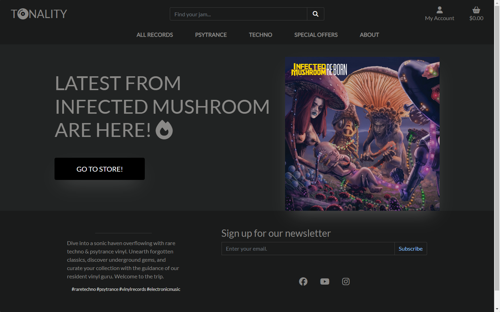

In crafting our website's aesthetic, we aimed to encapsulate the essence of the music scene it represents: dark, gritty, and atmospheric. While Techno is often associated with a monotonous, gray mood, we saw an opportunity to inject vibrancy and energy into the design.

Our mission was to make the album covers pop against the dark backdrop of the site, radiating vividness and vitality. By adding a subtle glow behind them, we enhanced their visual impact, turning them into captivating focal points that draw the eye.


Essentially, we wanted our records to stand out as beacons of color and excitement amidst a sea of darkness. By infusing dashes of vibrant hues into the design, we aimed to create a dynamic and engaging visual experience that mirrors the energy of the music itself.

And it's not just about Techno – we also paid homage to the shadowy allure of Psytrance. We balanced its dark undertones with bursts of psychedelic colors, capturing the genre's dynamic contrasts and enigmatic appeal.

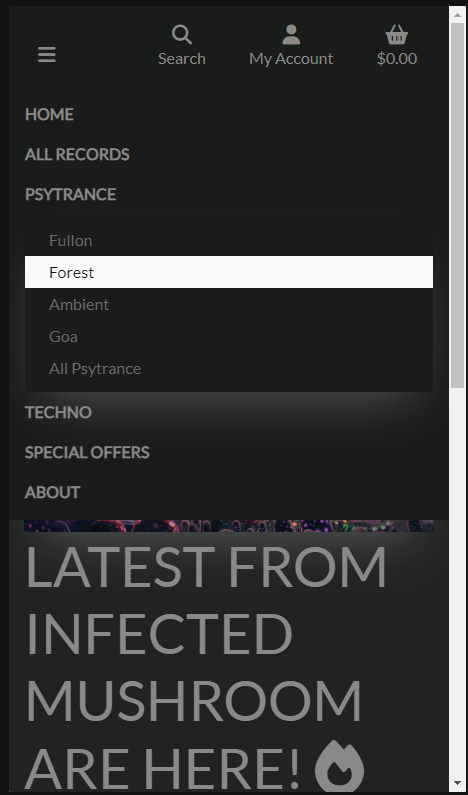

In short, our website isn't just a platform for browsing records – it's a captivating journey into the heart of the underground music scene, where every click is a step into a world of vibrant beats and electrifying melodies.

### Pros 
- Reduced eye strain: Dark themes can be easier on the eyes, especially in low-light environments. This is because they reduce the amount of bright light that is emitted from the screen.

- Modern look: Black backgrounds are often seen as being more modern and sleek than white backgrounds. This can be a good way to make a website look more up-to-date.

- Emphasis on content: A black background can help to make the content on a website stand out more. This is because there is a higher contrast between the text and the background.

### Cons

- Readability: If the contrast between the text and the background is not high enough, it can be difficult to read the text on a website with a black background.

- Accessibility: Some people with visual impairments may find it difficult to see text on a black background, using high contrast text is a must. 
 

## Colour Scheme

I used [coolors.co](https://coolors.co/) to generate my colour palette.

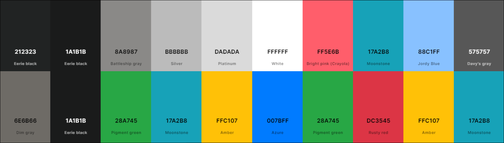

background colors. 
- `#212323` This dark grayish color is used for the body background, providing a subdued backdrop for the content. 
- `#1a1b1b;` Slightly darker than the body background, this color is primarily used for the footer and dropdown menus, adding depth to these sections.

Text colors
- `#8a8987`  A grayish tone utilized for general text throughout the site, ensuring readability against the dark background.
- `#bbbbbb`  Lighter than the general text color, this shade is used for links, navigation elements, and certain text elements, offering subtle contrast.
- `#dadada`  Even lighter than the link color, this grayish tone is applied to specific text elements, providing further differentiation.
- `#ffffff` Used for form controls and certain text elements, this white color stands out against the dark background, enhancing visibility.
- `#ff5e6b` A reddish tone employed for warnings and indicating withdrawal amounts for credit card transactions, alerting users to potential issues.

Links 
- `#17a2b8` A cyan color chosen for links, ensuring they stand out against the dark background and inviting user interaction.
- `#88c1ff` Light blue color used for primary outline buttons, providing a subtle yet noticeable accent to encourage action.

Buttons
- `#575757` When hovered over, buttons adopt this slightly darker background color with white text, enhancing interactivity and visual feedback.
- `#ffc107 ` ((btn-outline-warning - Yellow from bootsrap)
- `#007bff` (btn-outline-primary - Blue from bootstrap)
- `#28a745` (btn-outline-success- Green from bootstap)

Menu / nav
- `#1a1b1b` Dark background color employed for dropdown menus, ensuring contrast and visibility against the surrounding content.
- `rgb(110, 107, 102)` Grayish text color used for dropdown items within menus, providing clear readability and navigation options, used as text color in form control. 

Labels 
- `#000`  Black color utilized for special label texts, drawing attention to specific information or categories.
- `#28a745`  Greenish background color applied to indicate new items, attracting users' attention to recent additions.
- `#17a2b8`  Cyan background color used to signify deals, prompting users to explore discounted items.
- `#ffc107` Yellowish background color employed to highlight clearance items, encouraging users to take advantage of discounted products.

Arrow - Top line and marker for messages top right, under bag/cart.
- `#007bff` Blue color denoting primary messages or actions, ensuring important notifications stand out.
- `#28a745` Green color representing success, used for adding items to the bag or changing bag contents, providing positive feedback to users.
- `#dc3545` Red color indicating errors or critical messages, alerting users to issues that require attention.
- `#ffc107` Yellow color employed for warning messages, prompting users to proceed with caution.
- `#17a2b8`  Cyan color associated with informational messages, providing users with additional context or details.


## Typography

#### Modern and Clean Aesthetic:

- Lato's clean lines and geometric shapes contribute to a modern and minimalist feel, which perfectly complements the dark background. This combination avoids a cluttered look and emphasizes your content.

#### Readability on Dark Backgrounds:

- Lato excels in readability, especially at smaller sizes. This is crucial for websites with dark themes, as some fonts can become difficult to read on black. Lato's clear letterforms with good spacing ensure your content is easily digestible by visitors.

- [Lato](https://fonts.google.com/specimen/Lato) was used for all text.

- [Font Awesome](https://fontawesome.com) icons were used throughout the site, such as the social media icons in the footer.

## User Stories

### New Shopper

- As a new shopper, I would like to view a list of records, so that I can select some and purchase.

- As a new shopper, I would like to view different genres/categories of Records, so that I can easily find the style I prefer.

- As a new shopper, I would like to view a single record, so that I can see its details and make a proper decision.

- As a new shopper, I would like to be able to register for an account, so that I can see my profile.

- As a new shopper, I would like to get a confirmation email, so I can verify my account.

- As a new shopper, I want to be able to quickly see if there are any deals to be made.

- As a new shopper, I want to be able to quickly see the total amount of my shopping bag to avoid overspending.

- As a new shopper, I want to be able to search the site for a specific item.

- As a new shopper, I want to be able to view all my items in my shopping bag.

- As a new shopper, I want to be able to sort items to easily find the most rated (if I have created a rating system) or price.

- As a new shopper, I want to be able to adjust the number of items in my shopping bag.

- As a new shopper, I want to be able to easily enter my payment securely.

- As a new shopper, I want to have a confirmation of my order, to easily see that there are no mistakes.

### Returning Shopper

- As a returning Shopper, I would like to easily sign in and out, so that I can access my personal information.

- As a returning Shopper, I would like to have a personal profile, so that I can view my order history, and save my payment information.


### Site Admin

- As a site administrator, I want to be able to add an item to the store.
- As a site administrator, I want to be able to edit and update items in the store, with prices, images, and various options.
- As a site administrator, I must be able to remove an item that is no longer available.


## Wireframes
DONT FORGET! 
### Mobile Wireframes

<details>
<summary> Click here to see the Mobile Wireframes </summary>

Home
  - 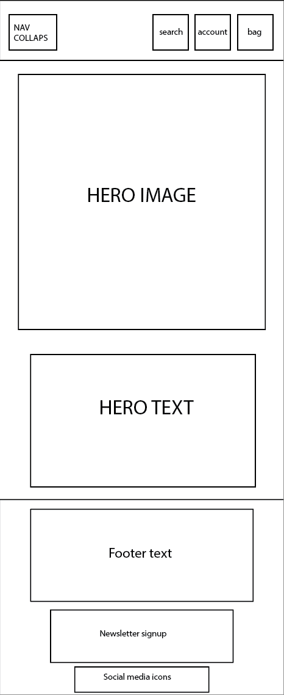

Records
  - 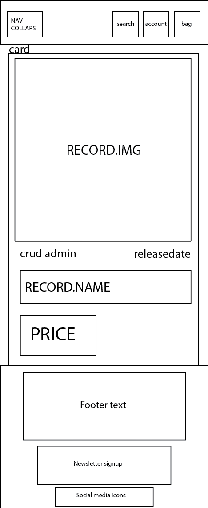

Record Details
  - 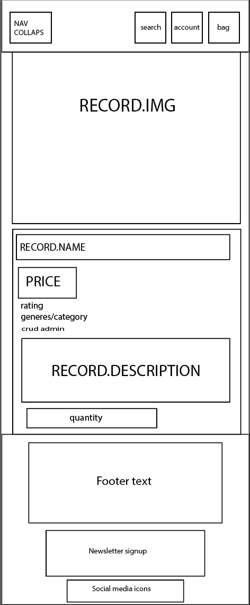

Bag
  - 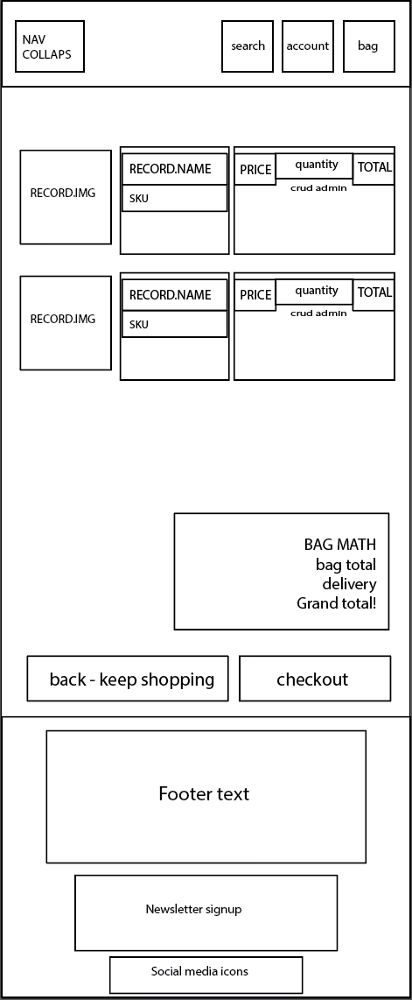

Checkout
  - 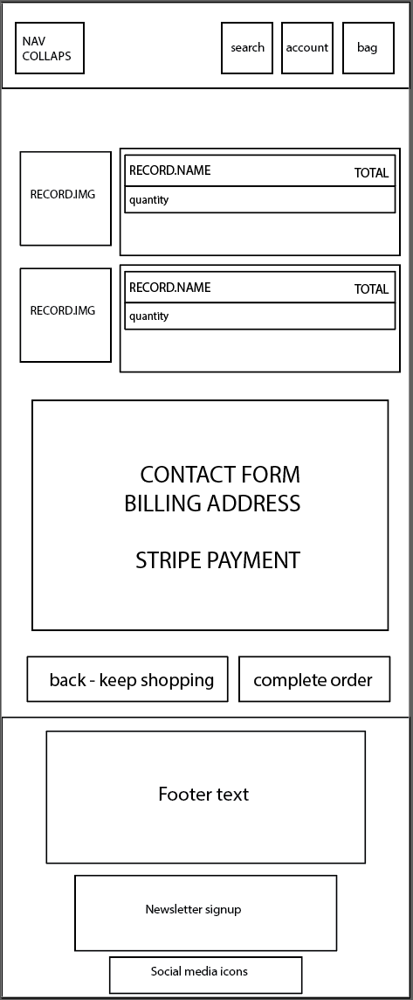

</details>

### Tablet Wireframes

<details>
<summary> Click here to see the Tablet Wireframes </summary>

Home
  - 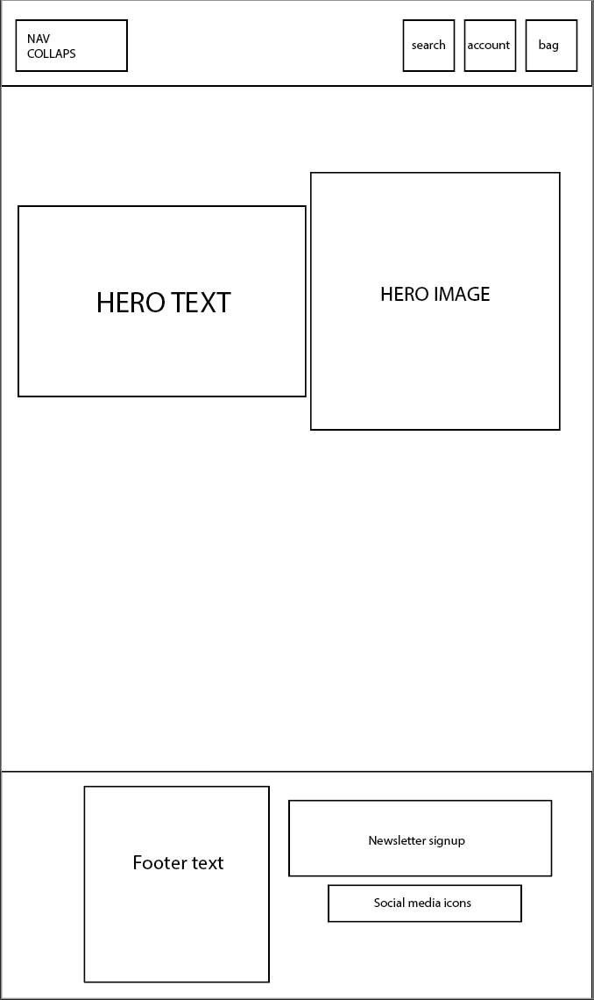

Records
  - 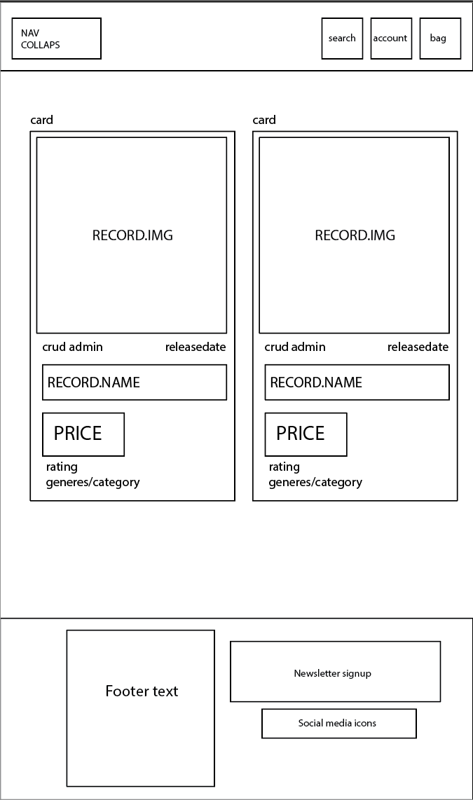

Record Details
  - 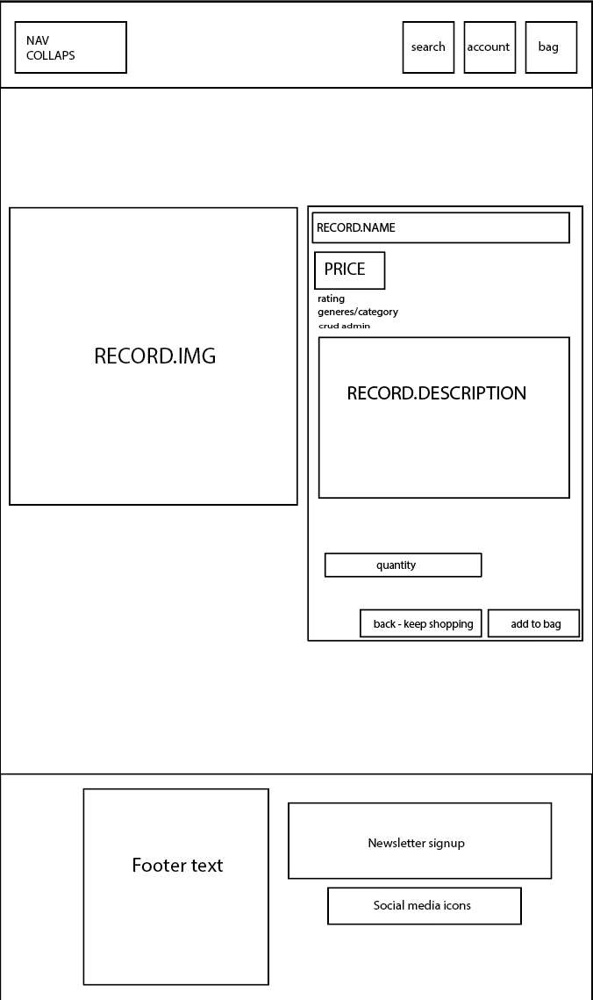

Bag
  - 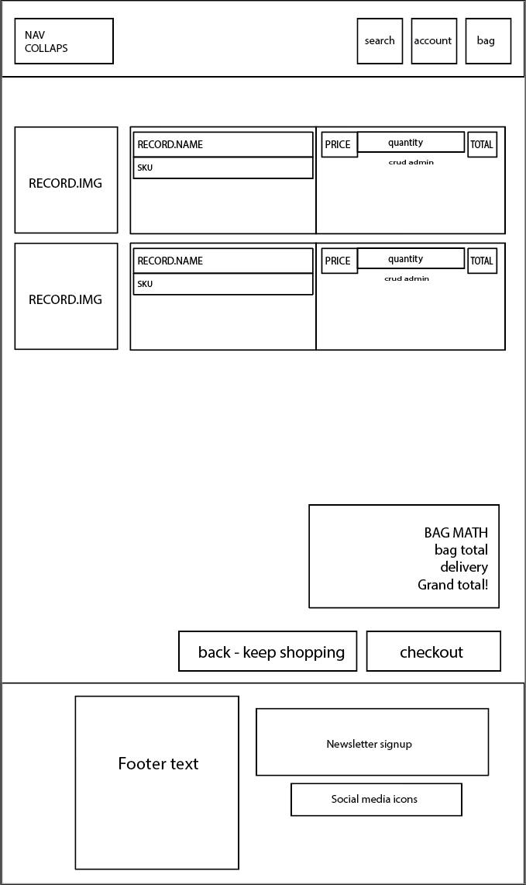

Checkout
  - 

</details>

### Desktop Wireframes

<details>
<summary> Click here to see the Desktop Wireframes </summary>

Home
  - 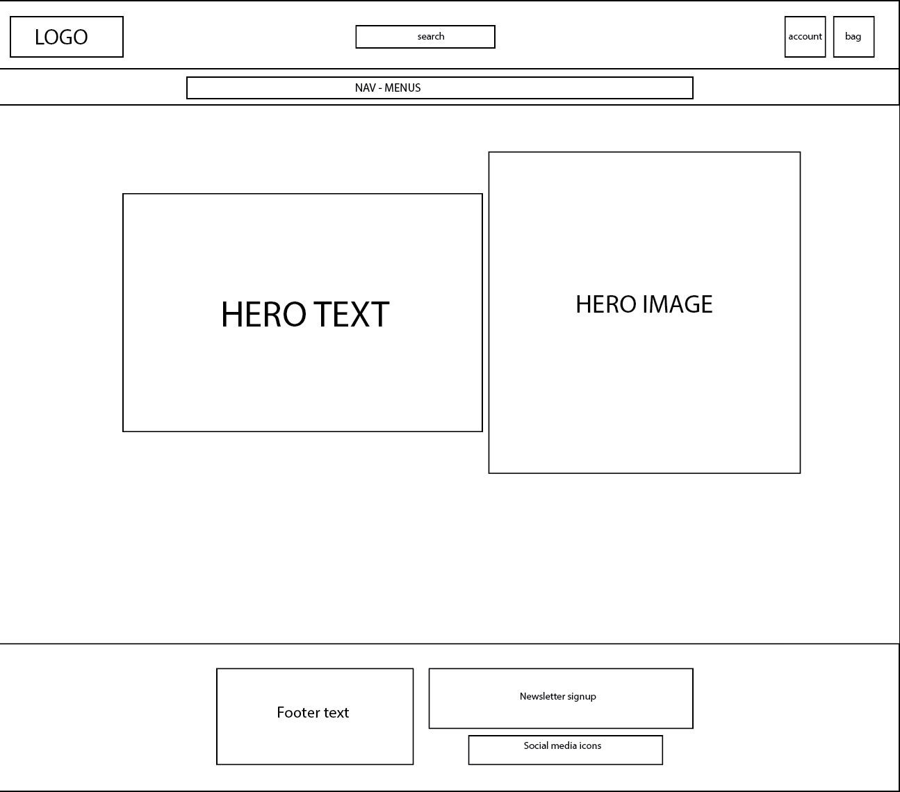

Records
  - 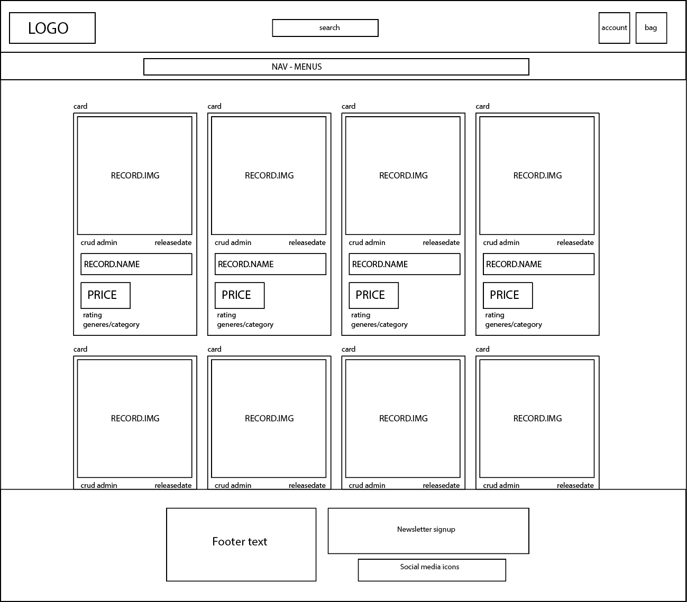

Record Details
  - 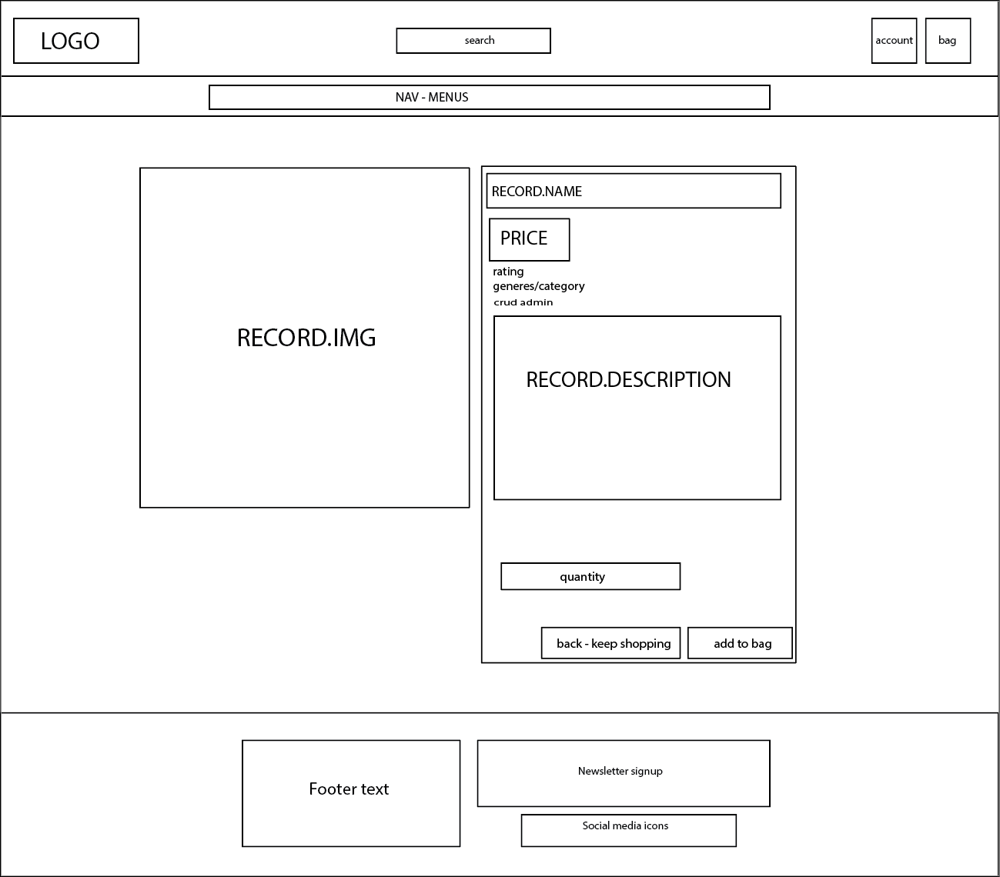

Bag
  - 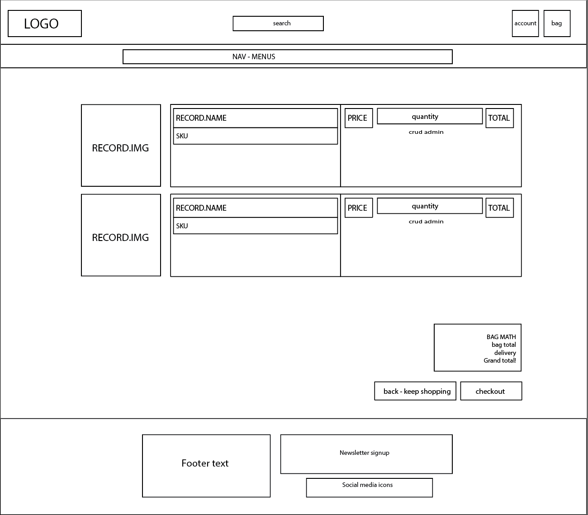

Checkout
  - 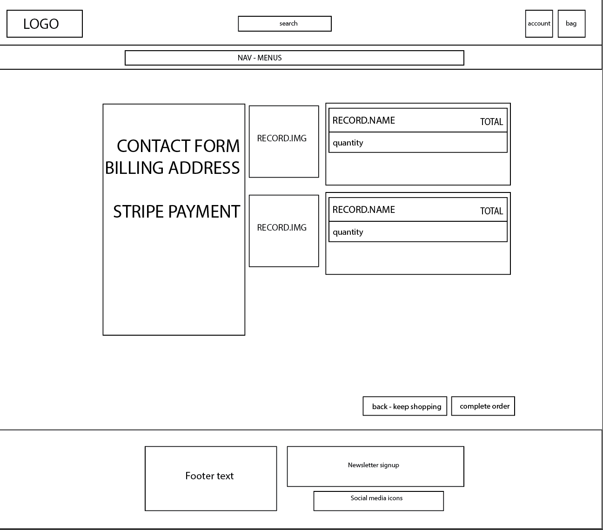

</details>

## Features

### Existing Features

- **Zoom Effect on Focus.**

    - I felt the need for some visual feedback to indicate where the user's focus is, so implementing a slight zoom effect seemed most appropriate. It's easily achievable using CSS and provides subtle enhancement without being overly intrusive. The intention was to create an effective visual cue without overshadowing the primary content. 

[](https://gyazo.com/011278d31712b9b77a08293e5765b828)

- **Add to Bag on Image Focus.**

    - To enhance user convenience, a decision was made to implement an "Add to Bag" or "Buy Now" button that appears atop the focused record cover image. This simplifies the process, allowing users to easily click on the button and add the record to their shopping bag.

[](https://gyazo.com/8b2ce80740d9477eebaba52887a97f56)

- **White form fields on focus.**

    - In order to enhance user clarity regarding active text input areas, I opted to style all text fields with a white background and black text. This deliberate choice creates a stark contrast against the darker background with light grey text, ensuring users can easily identify where they are inputting text. 

[](https://gyazo.com/e84927ee8e5337ba54e5c5202e9a4510)

- **Vibrant Buttons with Fill on Focus**

    - While colorful buttons serve their purpose, they were too conspicuous against the darker aesthetic of the site. Opting for btn-outline provided the desired ambiance with a subtle grey outline, complemented by colorful text. Additionally, transitioning to a filled color button on focus provided a visually engaging interaction without compromising the overall design coherence.

[](https://gyazo.com/9b592e55ee2507060f26b4d310f1d420) [](https://gyazo.com/361ff91026cc53dcbad882bc1b11d27e)

- **Dark Menus, Light Focus**

    - Adhering to the overarching theme, menus are designed with a dark color palette. However, to improve usability, they transition to a white background with black text upon focus. This change ensures clear visibility and contrast. Additionally, a subtle glow effect is applied behind them, enhancing their prominence against the darker backdrop.

[](https://gyazo.com/fa16138c2b328b5d73dd347d8af010a9)

- **Labels for Special Offers**

    - Noticeable labels are applied to denote new releases, deals, and clearance items. These labels feature relatively bold colors, serving as eye-catching indicators for users navigating the site. This approach aims to draw attention to these specific categories, aiding users in quickly identifying and exploring items of interest. 

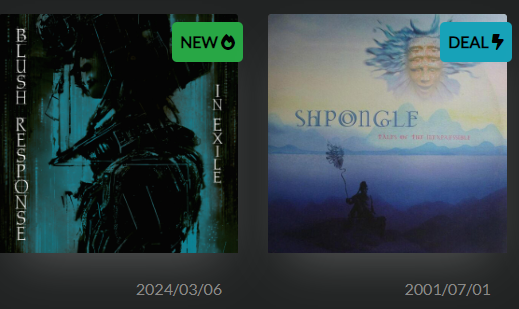


### Future Features

- BUY NOW
    - Enhancing user experience, i want a "Purchase Now" button, seamlessly paired with the "Add to Bag" feature upon focus. This streamlined approach allows customers to swiftly add their desired record to their bag and proceed directly to checkout with minimal clicks. Simplifying the purchasing process not only enhances user convenience but also contributes to improved business efficiency and customer satisfaction.
    

- Comments on records.
    - Introducing a comments section allows users to share opinions on tracks or records, fostering community engagement. It enriches the user experience, offering valuable insights for newcomers and providing a platform for loyal users to contribute to discussions, enhancing our platform's appeal and sense of community. Overall, the addition of a comments section fosters a sense of belonging and community within our platform, enhancing the overall user experience and solidifying our position as a hub for music lovers to discover, discuss, and appreciate their favorite tunes.


- YOUR-TITLE-FOR-FUTURE-FEATURE-#3
    - Any additional notes about this feature.


## Tools & Technologies Used

- [](https://tim.2bn.dev/markdown-builder) used to generate README and TESTING templates.
- [](https://git-scm.com) used for version control. (`git add`, `git commit`, `git push`)
- [](https://github.com) used for secure online code storage.
- [](https://code.visualstudio.com) used as my local IDE for development.
- [](https://en.wikipedia.org/wiki/HTML) used for the main site content.
- [](https://en.wikipedia.org/wiki/CSS) used for the main site design and layout.
- [](https://www.javascript.com) used for user interaction on the site.
- [](https://www.python.org) used as the back-end programming language.
- [](https://www.heroku.com) used for hosting the deployed back-end site.
- [](https://getbootstrap.com) used as the front-end CSS framework for modern responsiveness and pre-built components.
- [](https://www.djangoproject.com) used as the Python framework for the site.
- [](https://www.elephantsql.com) used as the Postgres database.
- [](https://stripe.com) used for online secure payments of ecommerce products/services.
- [](https://mail.google.com) used for sending emails in my application.
- [](https://aws.amazon.com/s3) used for online static file storage.
- [](https://fontawesome.com) used for the icons.
- [](https://dbeaver.io/download) used for ERD.
-  [phind](https://www.phind.com/) used for tips and trix, a great way to make progress when stuck.
- [Gemini](https://gemini.google.com/) Used for spell check, and grammar for README and TESTING.
- [Gyazo](https://gyazo.com/) Used for GIFs in README and TESTING.


## Database Design

FAQ 
```python
from django.db import models
class FAQ(models.Model):

    """ FAQs model with a question and answer. """
    question = models.CharField(max_length=250, null=False, blank=False)
    answer = models.TextField(null=False, blank=False)

    class Meta:
        verbose_name_plural = "FAQs"
        ordering = ["question"]

    def __str__(self):
        return self.question

```

- question: Stores the text of the question (limited to 250 characters).
- answer: Stores the detailed answer text for the FAQ entry.

Contact
```python
from django.db import models
class Contact(models.Model):
    """ Contact model asking for Name/Email/Message. """
    name = models.CharField(max_length=75, null=False, blank=False)
    email = models.EmailField(max_length=256, null=False, blank=False)
    message = models.TextField(null=False, blank=False)

    def __str__(self):
        return self.name
```

- name: Stores the user's name (limited to 75 characters).
- email: Stores the user's email address.
- message: Stores the message content from the us

Newsletter 
```python
from django.db import models
class Newsletter(models.Model):
    """ Newsletter model asking for email address. """
    email = models.EmailField(max_length=256, null=False, blank=False)

    def __str__(self):
        return self.email
```

- email: Stores the user's email address for the newsletter.

Profiles
```python
from django.db import models
from django.contrib.auth.models import User
from django.db.models.signals import post_save
from django.dispatch import receiver

from django_countries.fields import CountryField

class UserProfile(models.Model):
    """
    A user profile model for maintaining default
    delivery information and order history
    """
    user = models.OneToOneField(User, on_delete=models.CASCADE)
    default_phone_number = models.CharField(
        max_length=20, null=True, blank=True)
    default_street_address1 = models.CharField(
        max_length=80, null=True, blank=True)
    default_street_address2 = models.CharField(
        max_length=80, null=True, blank=True)
    default_town_or_city = models.CharField(
        max_length=40, null=True, blank=True)
    default_county = models.CharField(
        max_length=80, null=True, blank=True)
    default_postcode = models.CharField(
        max_length=20, null=True, blank=True)
    default_country = CountryField(
        blank_label='Country',
        null=True, blank=True)

    def __str__(self):
        return self.user.username

@receiver(post_save, sender=User)
def create_or_update_user_profile(sender, instance, created, **kwargs):
    """
    Create or update the user profile
    """
    if created:
        UserProfile.objects.create(user=instance)
    # Existing users: just save the profile
    instance.userprofile.save()
```

This model extends the default Django user model to store additional user information. It uses a one-to-one relationship with the User model, meaning each user can have one profile. Here's what it stores:

- default_phone_number: User's phone number (optional).
- default_street_address1: User's primary address line 1 (optional).
- default_street_address2: User's address line 2 (optional).
- default_town_or_city: User's city (optional).
- default_county: User's county (optional).
- default_postcode: User's postal code (optional).
- default_country: User's country (optional).
#### Relations:
- This model establishes a one-to-one relationship with Django's User model, ensuring that each user has a corresponding profile. This linkage is crucial for accessing and managing user-specific data and preferences.

Records
```python
from django.db import models
class Category(models.Model):

    class Meta:
        verbose_name = 'Categories'

    name = models.CharField(max_length=254)
    friendly_name = models.CharField(max_length=254, null=True, blank=True)

    def __str__(self):
        return self.name

    def get_friendly_name(self):
        return self.friendly_name


class Records(models.Model):

    class Meta:
        verbose_name = 'Records'

    category = models.ManyToManyField('Category', blank=True)
    sku = models.CharField(max_length=254, null=True, blank=True)
    name = models.CharField(max_length=254)
    description = models.TextField()
    releasedate = models.CharField(max_length=254, null=True, blank=True)
    price = models.DecimalField(max_digits=6, decimal_places=2)
    rating = models.DecimalField(
        max_digits=6, decimal_places=2, null=True, blank=True)
    image_url = models.URLField(max_length=1024, null=True, blank=True)
    image = models.ImageField(null=True, blank=True)
    is_new_release = models.BooleanField(
        default=False,
        verbose_name="Is New Release")
    is_deal = models.BooleanField(default=False, verbose_name="Is Deal")
    is_clearance = models.BooleanField(
        default=False, verbose_name="Is Clearance")

    def __str__(self):
        return self.nam

```

- Category: This is a many-to-many relationship, allowing a product to belong to multiple categories.
. sku: Stores the product's stock keeping unit (optional).
- name: The product name.
- description: A detailed description of the product.
- releasedate: The product's release date (optional).
- price: The product's price.
- rating: Stores the product rating (optional).
- image_url: URL to an image of the product (optional).
- image: Optionally allows uploading an image directly to the project.
- is_new_release: Boolean flag indicating a new release.
- is_deal: Boolean flag marking the product as a deal.
- is_clearance: Boolean flag marking the product for clearance.
#### Relations:
- This model is related to the Category model through a ManyToManyField, allowing each record to belong to multiple categories. This flexibility enables efficient organization and categorization of products within the application.

Generated via DBeaver < LINK!


## Agile Development Process
https://github.com/users/zakenaio/projects/3


### GitHub Projects

[GitHub Projects](https://github.com/zakenaio/pp5-tonality/projects) served as an Agile tool for this project.
It isn't a specialized tool, but with the right tags and project creation/issue assignments, it can be made to work.

Through it, user stories, issues, and tasks were planned, then tracked on a weekly basis using the basic Kanban board.


### GitHub Issues

[GitHub Issues](https://github.com/zakenaio/pp5-tonality/issues) served as an another Agile tool.


- [Open Issues](https://github.com/zakenaio/pp5-tonality/issues) [](https://github.com/zakenaio/pp5-tonality/issues)

    

- [Closed Issues](https://github.com/zakenaio/pp5-tonality/issues?q=is%3Aissue+is%3Aclosed) [](https://github.com/zakenaio/pp5-tonality/issues?q=is%3Aissue+is%3Aclosed)

    

### MoSCoW Prioritization

I've decomposed my Epics into stories prior to prioritizing and implementing them.
Using this approach, I was able to apply the MoSCow prioritization and labels to my user stories within the Issues tab.

- **Must Have**: guaranteed to be delivered (*max 60% of stories*)
- **Should Have**: adds significant value, but not vital (*the rest ~20% of stories*)
- **Could Have**: has small impact if left out (*20% of stories*)
- **Won't Have**: not a priority for this iteration

## Ecommerce Business Model

This site sells goods to individual customers, and therefore follows a `Business to Customer` model.
It is of the simplest **B2C** forms, as it focuses on individual transactions, and doesn't need anything
such as monthly/annual subscriptions.

It is still in its early development stages, although it already has a newsletter, and links for social media marketing.

Social media can potentially build a community of users around the business, and boost site visitor numbers,
especially when using larger platforms such a Facebook.

A newsletter list can be used by the business to send regular messages to site users.
For example, what items are on special offer, new items in stock,
updates to business hours, notifications of events, and much more!

## Search Engine Optimization (SEO) & Social Media Marketing

### Keywords

I've identified some appropriate keywords to align with my site, that should help users
when searching online to find my page easily from a search engine.
This included a series of the following keyword types

#### Short-tail (head terms) keywords
- Vinyl Records
- Techno Music
- Psytrance Music
- Classic Records
- Vinyl Store records
- Vinyl records
- Classic Techno
#### Long-tail keywords
- Best Techno Vinyl Records Collection
- Latest Psytrance Vinyl Releases
- Classic Vinyl Records for Sale
- Explore Techno and Psytrance Vinyls
- Buy Techno and Psytrance Vinyls Online
- Techno and Psytrance Vinyl Store
- Quality Techno and Psytrance Vinyl Records
- Find Your Perfect Beat with Techno and Psytrance Vinyls
- Authentic Techno and Psytrance Vinyl Albums
- Techno and Psytrance Vinyl Records Shop

I also played around with [Word Tracker](https://www.wordtracker.com) a bit
to check the frequency of some of my site's primary keywords (only until the free trial expired).

### Sitemap

I've used [XML-Sitemaps](https://www.xml-sitemaps.com) to generate a sitemap.xml file.
This was generated using my deployed site URL: https://tonality-ecom-12775aa6fe17.herokuapp.com

After it finished crawling the entire site, it created a
[sitemap.xml](sitemap.xml) which I've downloaded and included in the repository.

### Robots

I've created the [robots.txt](robots.txt) file at the root-level.
Inside, I've included the default settings:

```
User-agent: *
Disallow:
Sitemap: https://tonality-ecom-12775aa6fe17.herokuapp.com/sitemap.xml
```

Further links for future implementation:
- [Google search console](https://search.google.com/search-console)
- [Creating and submitting a sitemap](https://developers.google.com/search/docs/advanced/sitemaps/build-sitemap)
- [Managing your sitemaps and using sitemaps reports](https://support.google.com/webmasters/answer/7451001)
- [Testing the robots.txt file](https://support.google.com/webmasters/answer/6062598)

### Social Media Marketing

Creating a strong social base (with participation) and linking that to the business site can help drive sales.
Using more popular providers with a wider user base, such as Facebook, typically maximizes site views.

I've created mockups of Facebook, Instagram and Youtube. 


### Newsletter Marketing

I have incorporate a newsletter sign-up form on my application, to allow users to supply their
email address if they are interested in learning more. 

## Testing

> [!NOTE]  
> For all testing, please refer to the [TESTING.md](TESTING.md) file.

## Deployment

The live deployed application can be found deployed on [Heroku](https://tonality-ecom-12775aa6fe17.herokuapp.com).

### ElephantSQL Database

This project uses [ElephantSQL](https://www.elephantsql.com) for the PostgreSQL Database.

To obtain your own Postgres Database, sign-up with your GitHub account, then follow these steps:

- Click **Create New Instance** to start a new database.
- Provide a name (this is commonly the name of the project: pp4-interesting2).
- Select the **Tiny Turtle (Free)** plan.
- You can leave the **Tags** blank.
- Select the **Region** and **Data Center** closest to you.
- Once created, click on the new database name, where you can view the database URL and Password.

### Amazon AWS

This project uses [AWS](https://aws.amazon.com) to store media and static files online, due to the fact that Heroku doesn't persist this type of data.

Once you've created an AWS account and logged-in, follow these series of steps to get your project connected.
Make sure you're on the **AWS Management Console** page.

#### S3 Bucket

- Search for **S3**.
- Create a new bucket, give it a name (matching your Heroku app name), and choose the region closest to you.
- Uncheck **Block all public access**, and acknowledge that the bucket will be public (required for it to work on Heroku).
- From **Object Ownership**, make sure to have **ACLs enabled**, and **Bucket owner preferred** selected.
- From the **Properties** tab, turn on static website hosting, and type `index.html` and `error.html` in their respective fields, then click **Save**.
- From the **Permissions** tab, paste in the following CORS configuration:

	```shell
	[
		{
			"AllowedHeaders": [
				"Authorization"
			],
			"AllowedMethods": [
				"GET"
			],
			"AllowedOrigins": [
				"*"
			],
			"ExposeHeaders": []
		}
	]
	```

- Copy your **ARN** string.
- From the **Bucket Policy** tab, select the **Policy Generator** link, and use the following steps:
	- Policy Type: **S3 Bucket Policy**
	- Effect: **Allow**
	- Principal: `*`
	- Actions: **GetObject**
	- Amazon Resource Name (ARN): **paste-your-ARN-here**
	- Click **Add Statement**
	- Click **Generate Policy**
	- Copy the entire Policy, and paste it into the **Bucket Policy Editor**

		```shell
		{
			"Id": "Policy1234567890",
			"Version": "2012-10-17",
			"Statement": [
				{
					"Sid": "Stmt1234567890",
					"Action": [
						"s3:GetObject"
					],
					"Effect": "Allow",
					"Resource": "arn:aws:s3:::your-bucket-name/*"
					"Principal": "*",
				}
			]
		}
		```

	- Before you click "Save", add `/*` to the end of the Resource key in the Bucket Policy Editor (like above).
	- Click **Save**.
- From the **Access Control List (ACL)** section, click "Edit" and enable **List** for **Everyone (public access)**, and accept the warning box.
	- If the edit button is disabled, you need to change the **Object Ownership** section above to **ACLs enabled** (mentioned above).

#### IAM

Back on the AWS Services Menu, search for and open **IAM** (Identity and Access Management).
Once on the IAM page, follow these steps:

- From **User Groups**, click **Create New Group**.
	- Suggested Name: `group-pp5-tonality` (group + the project name)
- Tags are optional, but you must click it to get to the **review policy** page.
- From **User Groups**, select your newly created group, and go to the **Permissions** tab.
- Open the **Add Permissions** dropdown, and click **Attach Policies**.
- Select the policy, then click **Add Permissions** at the bottom when finished.
- From the **JSON** tab, select the **Import Managed Policy** link.
	- Search for **S3**, select the `AmazonS3FullAccess` policy, and then **Import**.
	- You'll need your ARN from the S3 Bucket copied again, which is pasted into "Resources" key on the Policy.

		```shell
		{
			"Version": "2012-10-17",
			"Statement": [
				{
					"Effect": "Allow",
					"Action": "s3:*",
					"Resource": [
						"arn:aws:s3:::your-bucket-name",
						"arn:aws:s3:::your-bucket-name/*"
					]
				}
			]
		}
		```
	
	- Click **Review Policy**.
	- Suggested Name: `policy-pp5-tonality` (policy + the project name)
	- Provide a description:
		- "Access to S3 Bucket for pp5-tonality static files."
	- Click **Create Policy**.
- From **User Groups**, click your "group-pp5-tonality".
- Click **Attach Policy**.
- Search for the policy you've just created ("policy-pp5-tonality") and select it, then **Attach Policy**.
- From **User Groups**, click **Add User**.
	- Suggested Name: `user-pp5-tonality` (user + the project name)
- For "Select AWS Access Type", select **Programmatic Access**.
- Select the group to add your new user to: `group-pp5-tonality`
- Tags are optional, but you must click it to get to the **review user** page.
- Click **Create User** once done.
- You should see a button to **Download .csv**, so click it to save a copy on your system.
	- **IMPORTANT**: once you pass this page, you cannot come back to download it again, so do it immediately!
	- This contains the user's **Access key ID** and **Secret access key**.
	- `AWS_ACCESS_KEY_ID` = **Access key ID**
	- `AWS_SECRET_ACCESS_KEY` = **Secret access key**

#### Final AWS Setup

- If Heroku Config Vars has `DISABLE_COLLECTSTATIC` still, this can be removed now, so that AWS will handle the static files.
- Back within **S3**, create a new folder called: `media`.
- Select any existing media images for your project to prepare them for being uploaded into the new folder.
- Under **Manage Public Permissions**, select **Grant public read access to this object(s)**.
- No further settings are required, so click **Upload**.

### Stripe API

This project uses [Stripe](https://stripe.com) to handle the ecommerce payments.

Once you've created a Stripe account and logged-in, follow these series of steps to get your project connected.

- From your Stripe dashboard, click to expand the "Get your test API keys".
- You'll have two keys here:
	- `STRIPE_PUBLIC_KEY` = Publishable Key (starts with **pk**)
	- `STRIPE_SECRET_KEY` = Secret Key (starts with **sk**)

As a backup, in case users prematurely close the purchase-order page during payment, we can include Stripe Webhooks.

- From your Stripe dashboard, click **Developers**, and select **Webhooks**.
- From there, click **Add Endpoint**.
	- `https://tonality-ecom-12775aa6fe17.herokuapp.com/checkout/wh/`
- Click **receive all events**.
- Click **Add Endpoint** to complete the process.
- You'll have a new key here:
	- `STRIPE_WH_SECRET` = Signing Secret (Wehbook) Key (starts with **wh**)

### Gmail API

This project uses [Gmail](https://mail.google.com) to handle sending emails to users for account verification and purchase order confirmations.

Once you've created a Gmail (Google) account and logged-in, follow these series of steps to get your project connected.

- Click on the **Account Settings** (cog icon) in the top-right corner of Gmail.
- Click on the **Accounts and Import** tab.
- Within the section called "Change account settings", click on the link for **Other Google Account settings**.
- From this new page, select **Security** on the left.
- Select **2-Step Verification** to turn it on. (verify your password and account)
- Once verified, select **Turn On** for 2FA.
- Navigate back to the **Security** page, and you'll see a new option called **App passwords**.
- This might prompt you once again to confirm your password and account.
- Select **Mail** for the app type.
- Select **Other (Custom name)** for the device type.
	- Any custom name, such as "Django" or pp5-tonality
- You'll be provided with a 16-character password (API key).
	- Save this somewhere locally, as you cannot access this key again later!
	- `EMAIL_HOST_PASS` = user's 16-character API key
	- `EMAIL_HOST_USER` = user's own personal Gmail email address

### Heroku Deployment

This project uses [Heroku](https://www.heroku.com), a platform as a service (PaaS) that enables developers to build, run, and operate applications entirely in the cloud.

Deployment steps are as follows, after account setup:

- Select **New** in the top-right corner of your Heroku Dashboard, and select **Create new app** from the dropdown menu.
- Your app name must be unique, and then choose a region closest to you (EU or USA), and finally, select **Create App**.
- From the new app **Settings**, click **Reveal Config Vars**, and set your environment variables.

> [!IMPORTANT]  
> This is a sample only; you would replace the values with your own if cloning/forking my repository.

| Key | Value |
| --- | --- |
| `AWS_ACCESS_KEY_ID` | user's own value |
| `AWS_SECRET_ACCESS_KEY` | user's own value |
| `DATABASE_URL` | user's own value |
| `DISABLE_COLLECTSTATIC` | 1 (*this is temporary, and can be removed for the final deployment*) |
| `EMAIL_HOST_PASS` | user's own value |
| `EMAIL_HOST_USER` | user's own value |
| `SECRET_KEY` | user's own value |
| `STRIPE_PUBLIC_KEY` | user's own value |
| `STRIPE_SECRET_KEY` | user's own value |
| `STRIPE_WH_SECRET` | user's own value |
| `USE_AWS` | True |

Heroku needs three additional files in order to deploy properly.

- requirements.txt
- Procfile
- runtime.txt

You can install this project's **requirements** (where applicable) using:

- `pip3 install -r requirements.txt`

If you have your own packages that have been installed, then the requirements file needs updated using:

- `pip3 freeze --local > requirements.txt`

The **Procfile** can be created with the following command:

- `echo web: gunicorn app_name.wsgi > Procfile`
- *replace **app_name** with the name of your primary Django app name; the folder where settings.py is located*

The **runtime.txt** file needs to know which Python version you're using:
1. type: `python3 --version` in the terminal.
2. in the **runtime.txt** file, add your Python version:
	- `python-3.9.18`

For Heroku deployment, follow these steps to connect your own GitHub repository to the newly created app:

Either:

- Select **Automatic Deployment** from the Heroku app.

Or:

- In the Terminal/CLI, connect to Heroku using this command: `heroku login -i`
- Set the remote for Heroku: `heroku git:remote -a app_name` (replace *app_name* with your app name)
- After performing the standard Git `add`, `commit`, and `push` to GitHub, you can now type:
	- `git push heroku main`

The project should now be connected and deployed to Heroku!

### Local Deployment

This project can be cloned or forked in order to make a local copy on your own system.

For either method, you will need to install any applicable packages found within the *requirements.txt* file.

- `pip3 install -r requirements.txt`.

You will need to create a new file called `env.py` at the root-level,
and include the same environment variables listed above from the Heroku deployment steps.

> [!IMPORTANT]  
> This is a sample only; you would replace the values with your own if cloning/forking my repository.

Sample `env.py` file:

```python
import os

os.environ.setdefault("AWS_ACCESS_KEY_ID", "user's own value")
os.environ.setdefault("AWS_SECRET_ACCESS_KEY", "user's own value")
os.environ.setdefault("DATABASE_URL", "user's own value")
os.environ.setdefault("EMAIL_HOST_PASS", "user's own value")
os.environ.setdefault("EMAIL_HOST_USER", "user's own value")
os.environ.setdefault("SECRET_KEY", "user's own value")
os.environ.setdefault("STRIPE_PUBLIC_KEY", "user's own value")
os.environ.setdefault("STRIPE_SECRET_KEY", "user's own value")
os.environ.setdefault("STRIPE_WH_SECRET", "user's own value")

# local environment only (do not include these in production/deployment!)
os.environ.setdefault("DEBUG", "True")
```

Once the project is cloned or forked, in order to run it locally, you'll need to follow these steps:

- Start the Django app: `python3 manage.py runserver`
- Stop the app once it's loaded: `CTRL+C` or `⌘+C` (Mac)
- Make any necessary migrations: `python3 manage.py makemigrations`
- Migrate the data to the database: `python3 manage.py migrate`
- Create a superuser: `python3 manage.py createsuperuser`
- Load fixtures (if applicable): `python3 manage.py loaddata file-name.json` (repeat for each file)
- Everything should be ready now, so run the Django app again: `python3 manage.py runserver`

If you'd like to backup your database models, use the following command for each model you'd like to create a fixture for:

- `python3 manage.py dumpdata your-model > your-model.json`
- *repeat this action for each model you wish to backup*

#### Cloning

You can clone the repository by following these steps:

1. Go to the [GitHub repository](https://github.com/zakenaio/pp5-tonality) 
2. Locate the Code button above the list of files and click it 
3. Select if you prefer to clone using HTTPS, SSH, or GitHub CLI and click the copy button to copy the URL to your clipboard
4. Open Git Bash or Terminal
5. Change the current working directory to the one where you want the cloned directory
6. In your IDE Terminal, type the following command to clone my repository:
	- `git clone https://github.com/zakenaio/pp5-tonality.git`
7. Press Enter to create your local clone.

Alternatively, if using Gitpod, you can click below to create your own workspace using this repository.

[](https://gitpod.io/#https://github.com/zakenaio/pp5-tonality)

Please note that in order to directly open the project in Gitpod, you need to have the browser extension installed.
A tutorial on how to do that can be found [here](https://www.gitpod.io/docs/configure/user-settings/browser-extension).

#### Forking

By forking the GitHub Repository, we make a copy of the original repository on our GitHub account to view and/or make changes without affecting the original owner's repository.
You can fork this repository by using the following steps:

1. Log in to GitHub and locate the [GitHub Repository](https://github.com/zakenaio/pp5-tonality)
2. At the top of the Repository (not top of page) just above the "Settings" Button on the menu, locate the "Fork" Button.
3. Once clicked, you should now have a copy of the original repository in your own GitHub account!

### Local VS Deployment

Local Development vs. Heroku Deployment: Key Differences

While developing and testing your application locally can be convenient, the environment is distinct from a live deployment setting like Heroku. Here's a breakdown of the key differences:

1. Logging:
Local: DEBUG mode is True, providing detailed error logs for easier troubleshooting.
Heroku: DEBUG is False to optimize performance and minimize security risks.


2. Database:
Local: You likely use a local database (e.g., SQLite) for convenience.
Heroku: Heroku's Postgres database offers a robust and managed solution for production use.


3. Sensitive Information:
Local: Sensitive data (e.g., SECRET_KEY, DATABASE_URL) might be stored in local configuration files.
Heroku: Store such information securely as environment variables in Heroku, accessible only to your application.


4. Static and Media Files:
Local: These files might be served directly from your local development environment.
Heroku: Services like Cloudinary and Whitenoise ensure efficient and secure delivery of static and media files in production.
By understanding these differences and making the necessary adjustments, you can ensure your application runs smoothly and securely on Heroku, providing a reliable and optimal experience for your users.

## Credits

### Code Snippets and Tutorials:
- [Zoom Card](https://www.w3schools.com/howto/howto_css_zoom_hover.asp)
- [New Release Design](https://www.w3schools.com/howto/howto_css_image_text.asp)
- [Shadow Effects](https://getcssscan.com/css-box-shadow-examples)
- [Widget Tweaks Crispy](https://github.com/jazzband/django-widget-tweaks)

### External Links:
- [Comprehensive Guide to Grading Vinyl Records](https://thevinylfactory.com/features/a-comprehensive-guide-to-grading-vinyl-records/)

### Images:
#### images for about/faq section
- Lot of 20 Random Vinyl Records Vintage Collection 
- Sound Waves Vector Illustration 

#### Album covers 
- are all sourced from Discorg. 
- [Discorg](https://www.discogs.com/)

### Content

| Source | Location | Notes |
| --- | --- | --- |
| [Markdown Builder](https://tim.2bn.dev/markdown-builder) | README and TESTING | tool to help generate the Markdown files |

### Media

| Source | Location | Type | Notes |
| --- | --- | --- | --- |
| [Pexels](https://www.pexels.com) | entire site | image | favicon on all pages |


### Acknowledgements

- I would like to thank my Code Institute mentor, [Tim Nelson](https://github.com/TravelTimN) for his support throughout the development of this project.
- I would like to thank the [Code Institute](https://codeinstitute.net) tutor team for their assistance with troubleshooting and debugging some project issues.
- I would like to thank the [Code Institute Slack community](https://code-institute-room.slack.com) for the moral support; it kept me going during periods of self doubt and imposter syndrome.

