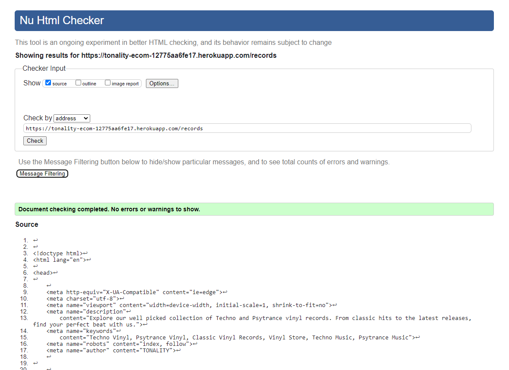
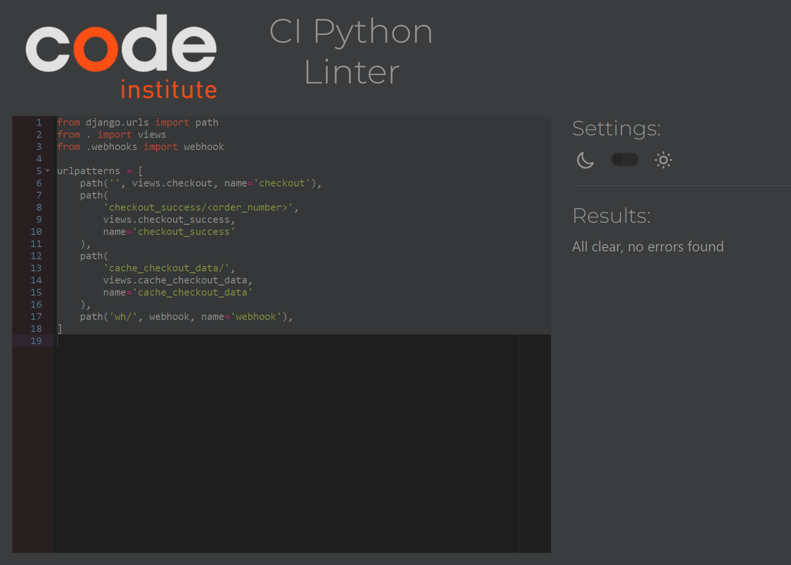
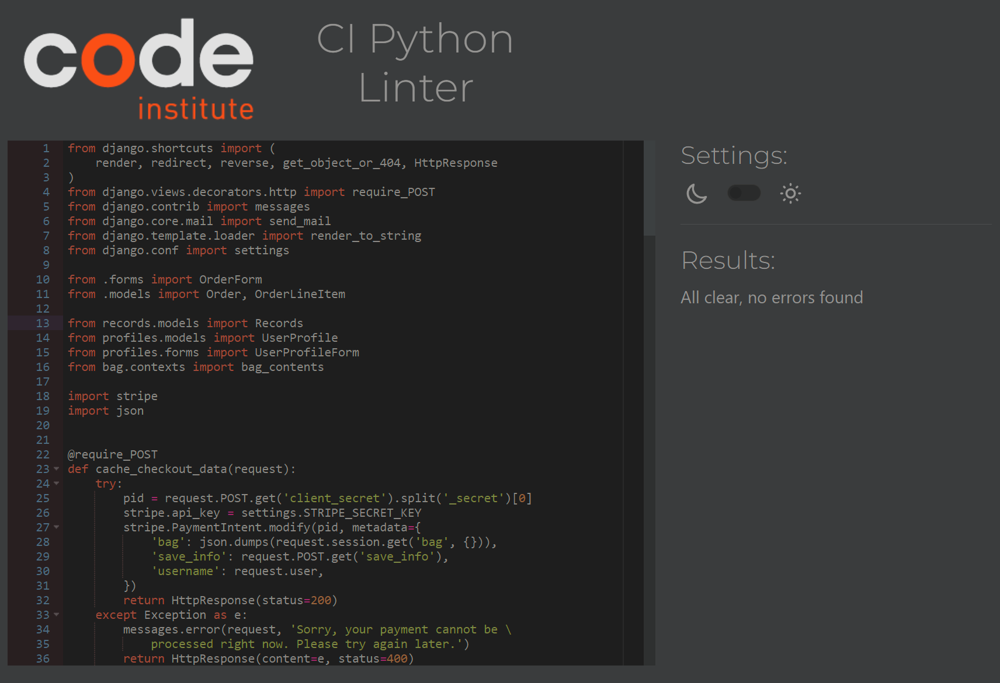
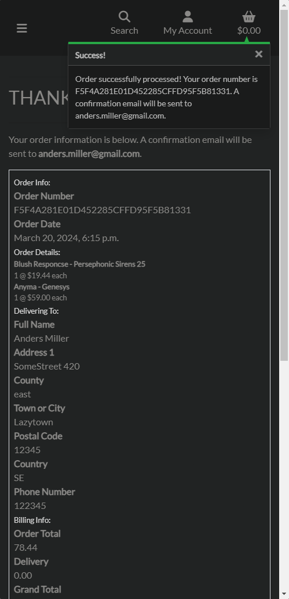
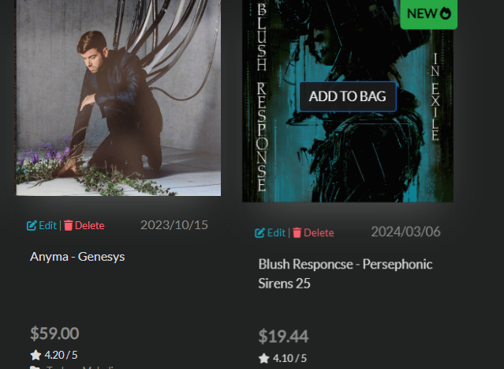

# Testing

> [!NOTE]  
> Return back to the [README.md](README.md) file.

## Code Validation

### HTML

I have used the recommended [HTML W3C Validator](https://validator.w3.org) to validate all of my HTML files.

| Directory | File | Screenshot | Notes |
| --- | --- | --- | --- |
| about | about.html |  | |
| bag | bag.html |  | |
| checkout | checkout.html |  | |
| checkout | checkout_success.html |  | |
| home | index.html |  | |
| profiles | profile.html |  | |
| records | add_record.html |  | |
| records | edit_record.html |  | |
| records | record_detail.html |  | |
| records | records.html |  | |
| templates | 404.html |  | |

### CSS

I have used the recommended [CSS Jigsaw Validator](https://jigsaw.w3.org/css-validator) to validate all of my CSS files.

| Directory | File | Screenshot | Notes |
| --- | --- | --- | --- |
| checkout | checkout.css |  | |
| profiles | profile.css |  | |
| static | base.css |  | |

### JavaScript

I have used the recommended [JShint Validator](https://jshint.com) to validate all of my JS files.

| Directory | File | Screenshot | Notes |
| --- | --- | --- | --- |
| checkout | stripe_elements.js |  | |
| profiles | countryfield.js |  | |

### Python

I have used the recommended [PEP8 CI Python Linter](https://pep8ci.herokuapp.com) to validate all of my Python files.

| Directory | File | CI URL | Screenshot | Notes |
| --- | --- | --- | --- | --- |
| about | urls.py | [PEP8 CI](https://pep8ci.herokuapp.com/https://raw.githubusercontent.com/zakenaio/pp5-tonality/main/about/urls.py) |  | |
| about | views.py | [PEP8 CI](https://pep8ci.herokuapp.com/https://raw.githubusercontent.com/zakenaio/pp5-tonality/main/about/views.py) |  | |
| Directory | File | CI URL | Screenshot | Notes |
| bag | contexts.py | [PEP8 CI](https://pep8ci.herokuapp.com/https://raw.githubusercontent.com/zakenaio/pp5-tonality/main/bag/contexts.py) |  | |
| bag | bag_tools.py | [PEP8 CI](https://pep8ci.herokuapp.com/https://raw.githubusercontent.com/zakenaio/pp5-tonality/main/bag/templatetags/bag_tools.py) |  | |
| bag | urls.py | [PEP8 CI](https://pep8ci.herokuapp.com/https://raw.githubusercontent.com/zakenaio/pp5-tonality/main/bag/urls.py) |  | |
| bag | views.py | [PEP8 CI](https://pep8ci.herokuapp.com/https://raw.githubusercontent.com/zakenaio/pp5-tonality/main/bag/views.py) |  | |
| Directory | File | CI URL | Screenshot | Notes |
| checkout | admin.py | [PEP8 CI](https://pep8ci.herokuapp.com/https://raw.githubusercontent.com/zakenaio/pp5-tonality/main/checkout/admin.py) |  | |
| checkout | forms.py | [PEP8 CI](https://pep8ci.herokuapp.com/https://raw.githubusercontent.com/zakenaio/pp5-tonality/main/checkout/forms.py) |  | |
| checkout | models.py | [PEP8 CI](https://pep8ci.herokuapp.com/https://raw.githubusercontent.com/zakenaio/pp5-tonality/main/checkout/models.py) |  | |
| checkout | signals.py | [PEP8 CI](https://pep8ci.herokuapp.com/https://raw.githubusercontent.com/zakenaio/pp5-tonality/main/checkout/signals.py) |  | |
| checkout | urls.py | [PEP8 CI](https://pep8ci.herokuapp.com/https://raw.githubusercontent.com/zakenaio/pp5-tonality/main/checkout/urls.py) |  | |
| checkout | views.py | [PEP8 CI](https://pep8ci.herokuapp.com/https://raw.githubusercontent.com/zakenaio/pp5-tonality/main/checkout/views.py) |  | |
| checkout | webhook_handler.py | [PEP8 CI](https://pep8ci.herokuapp.com/https://raw.githubusercontent.com/zakenaio/pp5-tonality/main/checkout/webhook_handler.py) |  | |
| checkout | webhooks.py | [PEP8 CI](https://pep8ci.herokuapp.com/https://raw.githubusercontent.com/zakenaio/pp5-tonality/main/checkout/webhooks.py) |  | |
| Directory | File | CI URL | Screenshot | Notes |
| contact | context_processors.py | [PEP8 CI](https://pep8ci.herokuapp.com/https://raw.githubusercontent.com/zakenaio/pp5-tonality/main/contact/context_processors.py) |  | |
| contact | forms.py | [PEP8 CI](https://pep8ci.herokuapp.com/https://raw.githubusercontent.com/zakenaio/pp5-tonality/main/contact/forms.py) |  | |
| contact | models.py | [PEP8 CI](https://pep8ci.herokuapp.com/https://raw.githubusercontent.com/zakenaio/pp5-tonality/main/contact/models.py) |  | |
| contact | urls.py | [PEP8 CI](https://pep8ci.herokuapp.com/https://raw.githubusercontent.com/zakenaio/pp5-tonality/main/contact/urls.py) |  | |
| contact | views.py | [PEP8 CI](https://pep8ci.herokuapp.com/https://raw.githubusercontent.com/zakenaio/pp5-tonality/main/contact/views.py) |  | |
| Directory | File | CI URL | Screenshot | Notes |
| faq | admin.py | [PEP8 CI](https://pep8ci.herokuapp.com/https://raw.githubusercontent.com/zakenaio/pp5-tonality/main/faq/admin.py) |  | |
| faq | context_processors.py | [PEP8 CI](https://pep8ci.herokuapp.com/https://raw.githubusercontent.com/zakenaio/pp5-tonality/main/faq/context_processors.py) |  | |
| faq | models.py | [PEP8 CI](https://pep8ci.herokuapp.com/https://raw.githubusercontent.com/zakenaio/pp5-tonality/main/faq/models.py) |  | |
| faq | urls.py | [PEP8 CI](https://pep8ci.herokuapp.com/https://raw.githubusercontent.com/zakenaio/pp5-tonality/main/faq/urls.py) |  | |
| faq | views.py | [PEP8 CI](https://pep8ci.herokuapp.com/https://raw.githubusercontent.com/zakenaio/pp5-tonality/main/faq/views.py) |  | |
| Directory | File | CI URL | Screenshot | Notes |
| home | urls.py | [PEP8 CI](https://pep8ci.herokuapp.com/https://raw.githubusercontent.com/zakenaio/pp5-tonality/main/home/urls.py) |  | |
| home | views.py | [PEP8 CI](https://pep8ci.herokuapp.com/https://raw.githubusercontent.com/zakenaio/pp5-tonality/main/home/views.py) |  | |
| Directory | File | CI URL | Screenshot | Notes |
| newsletter | content_processor.py | [PEP8 CI](https://pep8ci.herokuapp.com/https://raw.githubusercontent.com/zakenaio/pp5-tonality/main/newsletter/content_processor.py) |  | |
| newsletter | forms.py | [PEP8 CI](https://pep8ci.herokuapp.com/https://raw.githubusercontent.com/zakenaio/pp5-tonality/main/newsletter/forms.py) |  | |
| newsletter | models.py | [PEP8 CI](https://pep8ci.herokuapp.com/https://raw.githubusercontent.com/zakenaio/pp5-tonality/main/newsletter/models.py) |  | |
| newsletter | urls.py | [PEP8 CI](https://pep8ci.herokuapp.com/https://raw.githubusercontent.com/zakenaio/pp5-tonality/main/newsletter/urls.py) |  | |
| newsletter | views.py | [PEP8 CI](https://pep8ci.herokuapp.com/https://raw.githubusercontent.com/zakenaio/pp5-tonality/main/newsletter/views.py) |  | |
| Directory | File | CI URL | Screenshot | Notes |
| profiles | forms.py | [PEP8 CI](https://pep8ci.herokuapp.com/https://raw.githubusercontent.com/zakenaio/pp5-tonality/main/profiles/forms.py) |  | |
| profiles | models.py | [PEP8 CI](https://pep8ci.herokuapp.com/https://raw.githubusercontent.com/zakenaio/pp5-tonality/main/profiles/models.py) |  | |
| profiles | urls.py | [PEP8 CI](https://pep8ci.herokuapp.com/https://raw.githubusercontent.com/zakenaio/pp5-tonality/main/profiles/urls.py) |  | |
| profiles | views.py | [PEP8 CI](https://pep8ci.herokuapp.com/https://raw.githubusercontent.com/zakenaio/pp5-tonality/main/profiles/views.py) |  | |
| Directory | File | CI URL | Screenshot | Notes |
| records | admin.py | [PEP8 CI](https://pep8ci.herokuapp.com/https://raw.githubusercontent.com/zakenaio/pp5-tonality/main/records/admin.py) |  | |
| records | forms.py | [PEP8 CI](https://pep8ci.herokuapp.com/https://raw.githubusercontent.com/zakenaio/pp5-tonality/main/records/forms.py) |  | |
| records | models.py | [PEP8 CI](https://pep8ci.herokuapp.com/https://raw.githubusercontent.com/zakenaio/pp5-tonality/main/records/models.py) |  | |
| records | urls.py | [PEP8 CI](https://pep8ci.herokuapp.com/https://raw.githubusercontent.com/zakenaio/pp5-tonality/main/records/urls.py) |  | |
| records | views.py | [PEP8 CI](https://pep8ci.herokuapp.com/https://raw.githubusercontent.com/zakenaio/pp5-tonality/main/records/views.py) |  | |
| records | widgets.py | [PEP8 CI](https://pep8ci.herokuapp.com/https://raw.githubusercontent.com/zakenaio/pp5-tonality/main/records/widgets.py) |  | |
| Directory | File | CI URL | Screenshot | Notes |
| tonality | urls.py | [PEP8 CI](https://pep8ci.herokuapp.com/https://raw.githubusercontent.com/zakenaio/pp5-tonality/main/tonality/urls.py) |  | |
|  | custom_storages.py | [PEP8 CI](https://pep8ci.herokuapp.com/https://raw.githubusercontent.com/zakenaio/pp5-tonality/main/custom_storages.py) |  | |

## Browser Compatibility

I've tested my deployed project on multiple browsers to check for compatibility issues.

| Browser | Home | About | Contact | etc | Notes |
| --- | --- | --- | --- | --- | --- |
| Chrome |  |  |  |  | Works as expected |
| Firefox |  |  |  |  | Works as expected |
| Edge |  |  |  |  | Works as expected |
| Safari |  |  |  |  | Minor CSS differences |
| Brave |  |  |  |  | Works as expected |
| Opera |  |  |  |  | Minor differences |
| repeat for any other tested browsers | x | x | x | x | x |

## Responsiveness

I've tested my deployed project on multiple devices to check for responsiveness issues.

| Device | Home | About | Contact | Records | Details | Bag | Checkout | Checkout2 | Edit | Add | Sign in | Order | Faq |
| --- | --- | --- | --- | --- | --- | --- | --- | --- | --- | --- | --- | --- | --- |
| Mobile Small |  |  |  |  |  |  |  |  |  |  |  |  |  |
| Mobile Medium |  |  |  |  |  |  |  |  |  |  |  |  |  |
| Mobile Large |  |  |  |  |  |  |  |  |  |  |  |  |  |
| Tablet |  |  |  |  |  |  |  |  |  |  |  |  |  |
| Desktop Small |  |  |  |  |  |  |  |  |  |  |  |  |  |
| Desktop Medium |  |  |  |  |  |  |  |  |  |  |  |  |  |
| Desktop Large |  |  |  |  |  |  |  |  |  |  |  |  |  |

## Lighthouse Audit

I've tested my deployed project using the Lighthouse Audit tool to check for any major issues.

| Page | Mobile | Desktop | Notes |
| --- | --- | --- | --- |
| Home |  |  | some warnings regarding third-party cookies in Best Practice |
| About |  |  | slow on mobile, heroku/amazon. same cookies|
| Records |  |  | Slow performance, many images from ams. |
| Details |  |  | Slow ams, same cookie warning |
| Bag |  |  | slow, inc/decr-buttons have no names, links are not crawlable, same cookie warning  |
| Checkout |  |  | Same as others|
| Edit |  |  | |
| Add |  |  | |
| Sign in |  |  | |

## Defensive Programming

| Page | Expectation | Test | Result | Fix | Screenshot |
| --- | --- | --- | --- | --- | --- |
| Home | | | | | |
| | Clicking on a menu item brings me to the page | Does menu appear when clicked? | When clicked a menu appears, and you are redirected to the clicked page | Test concluded and passed | ) |
| | Entering a search term and clicking the magnifying glass should give me search results | tested by typing a seach quiery | page refresh an a result was shown |  | ) |
| Records | | | | | |
| | When hovering over a Record cover, the button for adding to bag should appear. | Hover over a record cover to see if the add to bag button appears. | The button appeared as expected. | Test concluded and passed |  |
| | Filtering records by genre should display only records from the selected genre. | Select a genre from the filter options and observe the records displayed. | Only records from the selected genre were displayed. | Test concluded and passed |  |
| | Sorting records by price, from low to high, should reorder the records accordingly. | Select the "Price Low to High" sorting option and observe the order of records. | Records were reordered from lowest to highest price as expected. | Test concluded and passed |  |
| | Searching for a record by name should display relevant results. | Type a record name in the search bar and submit the search. | The search returned records with matching names. | Test concluded and passed |  |
| | Viewing record details should display all relevant information about the record. | Click on a record to view its details. | The details page displayed all relevant information including tracklist, genre, and price. | Test concluded and passed |  |
| Bag | | | | | |
| | Clicking on the "View Bag" button should take me to the bag page | Click "View Bag" after adding items | Redirects to the bag page with items listed | Test concluded and passed |  |
| | Updating the quantity of an item in the bag should reflect the correct total price | Change quantity and click "Update" | Total price updates accordingly | Test concluded and passed |  |
| | Removing an item from the bag should remove it from the list and update the total price | Click "Remove" on an item | Item is removed and total price updates | Test concluded and passed |  |
| Edit | | | | | |
| | Editing a record's details should update the record with the new information | Modify details and save | Record is updated with new details | Test concluded and passed |  |
| Add | | | | | |
| | Adding a new record should list it in the records page | Fill in details and save | New record appears in the list | Test concluded and passed |  |
| | Required fields must be filled to successfully add a record | Attempt to save with missing required fields | Error messages for missing fields displayed | Test concluded and passed |  |
| Sign In | | | | | |
| | Entering correct credentials should sign the user in | Enter username and password and submit | User is signed in and redirected to the homepage | Test concluded and passed |  |
| | Entering incorrect credentials should display an error message | Enter incorrect username or password and submit | Error message displayed, preventing sign in | Test concluded and passed |  |
| | Signing out should redirect the user to the homepage | Click the sign-out button | User is signed out and redirected to the homepage | Test concluded and passed |  |
| Sign Up | | | | | |
| | Filling in the registration form correctly should create a new user account | Fill in the registration form and submit | New user account is created and confirmation email is sent | Test concluded and passed |  |
| | Attempting to register with an already used email should display an error | Use an email already in the system and submit | Error message displayed, preventing account creation | Test concluded and passed |  |
| | After successful registration, the user should be redirected to a confirmation page or the homepage | Complete registration successfully | User is redirected to the homepage or a confirmation page | Test concluded and passed |  |

## User Story Testing

| User Story | Screenshot |
| --- | --- |
|As a new shopper, I would like to view a list of records, so that I can select some and purchase. | |
|As a new shopper, I would like to view different genres/categories of Records, so that I can easily find the style I prefer. | |
|As a new shopper, I would like to view a single record, so that I can see its details and make a proper decision. | |
|As a new shopper, I would like to be able to register for an account, so that I can see my profile. | |
|As a new shopper, I would like to get a confirmation email, so I can verify my account. | |
|As a new shopper, I want to be able to quickly see if there are any deals to be made. | |
|As a new shopper, I want to be able to quickly see the total amount of my shopping bag to avoid overspending. | |
|As a new shopper, I want to be able to search the site for a specific item. | |
|As a new shopper, I want to be able to view all my items in my shopping bag. |  |
|As a new shopper, I want to be able to sort on price, and rating. | |
|As a new shopper, I would like to view different genres/categories of Records, so that I can easily find the style I prefer. | |
|As a new shopper, I want to be able to adjust the number of items in my shopping bag. | |
|As a new shopper, I want to be able to easily enter my payment securely. | |
|As a new shopper, I want to have a confirmation of my order, to easily see that there are no mistakes. | |
|As a returning Shopper, I would like to easily sign in and out, so that I can access my personal information. | |
|As a returning Shopper, I would like to have a personal profile, so that I can view my order history, and save my payment information. | |
|As a site administrator, I want to be able to add an item to the store. | |
|As a site administrator, I want to be able to edit and update items in the store, with prices, images, and various options. | |
|As a site administrator, I must be able to remove an item that is no longer available. | |

## Bugs

- Experienced a small issue with seach term.

    

    - Issue with a line break in the lin {{ seach.term }} making it not render correctly.

> [!NOTE]  
> There are no remaining bugs that I am aware of.
